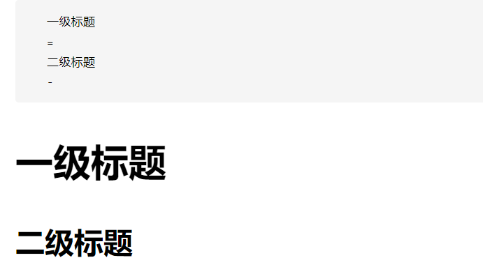
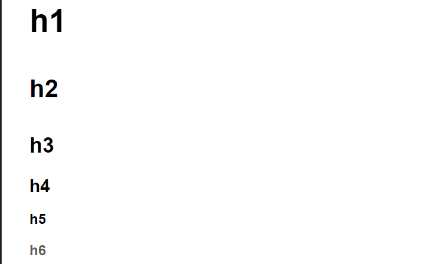
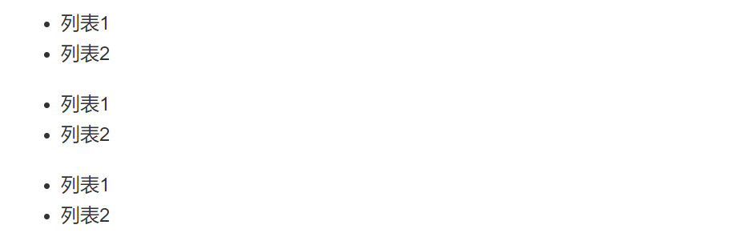
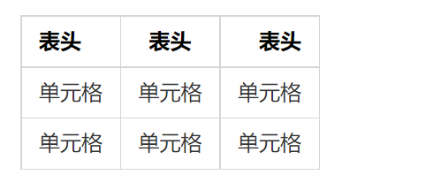

##### 写在前面
> > We believe that writing is about content, about what you want to say – not about fancy formatting.  
> >
> > 重内容,轻形式


> 1. 此教程仅个人整理,**仅入门**,如有错误,还望指正
> 2. 此教程所用编辑器为 <u>**VSCode**</u>
> 3. 需要用到的插件 <u>**Markdown Preview Enhanced**</u>

### Markdown简介
- Markdown 是一种**轻量级标记语言**，它允许人们使用易读易写的纯文本格式编写文档。
- Markdown 语言在 2004 由约翰·格鲁伯（英语：John Gruber）创建。最开始是为了让使用者更方便的转换html
- Markdown 编写的文档可以导出 HTML 、Word、图像、PDF、Epub 等多种格式的文档。
- Markdown 编写的文档后缀为 `.md` , `.markdown`
  

### Markdown 的优点
- 专注你的文字内容而不是排版样式，安心写作。
- 轻松的导出 HTML、PDF 和本身的 .md 文件。
- 纯文本内容，兼容所有的文本编辑器与字处理软件。
- 随时修改你的文章版本，不必像字处理软件生成若干文件版本导致混乱。
- 可读、直观、学习成本低。


### Markdown标题
1. 使用 = 和 - 标记一级和二级标题

  


2. 使用 # 号标记
     - 使用 # 号可表示 1-6 级标题，一级标题对应一个 # 号，二级标题对应两个 # 号，以此类推。
        ```
        # h1
        ## h2
        ### h3
        #### h4
        ##### h5
        ###### h6
        ```
        


  

  ### Markdown段落
  1. 段落换行
      - 段落的换行是使用两个以上空格加上回车  
      - 也可以在段落后面使用一个空行来表示重新开始一个段落。

  2. 字体样式
        ```
            - *斜体文字*
            - _斜体文字_
            - __粗体文字__
            - ***粗斜体文字***
            - ___粗斜体文字___
        ```
        


  3. 分割线
     - 在一行中用三个以上的星号、减号、下划线来建立一个分隔线，行内不能有其他东西
     - 也可以在星号或是减号中间插入空格
        ```
        * * *
        - - -
        ******
        ------
        ```
        

  4. 删除线
     - 只需要在需要加删除线的文字的两端加上两个波浪线 ~~ 即可
    `
      ~~删除线~~
    `
    
  
  5. 下划线
     - 可以通过 HTML 的标签来实现

    `
     <u>下划线</u>
  `
  


   1. 脚注
        - 脚注是对文本的补充说明。
        - 格式为: [^ 内容]
            ```
                    致谢[^文本]
                    [^文本]: 感谢观看此教程
            
            ```
            

 


  ### Markdown列表
  1. 无序列表
     - 无序列表使用星号(*)、加号(+)或是减号(-)作为列表标记，这些标记后面要添加一个空格，然后再填写内容

        ```
        * 列表1
        * 列表2
        
        + 列表1
        + 列表2
        
        - 列表1
        - 列表2
        ```

        

  2. 有序列表
     -  有序列表使用数字并加上 . 号来表示
        ```
        1. 排名1
        2. 排名2
        
        ```
        
  3. 列表嵌套
     - 列表嵌套只需在子列表中的选项前面添加四个空格
        ```
        - 列表1
            1. 排名1
            2. 排名2
        - 列表2
            1. 排名1
            2. 排名2
        ```
        

### Markdown 区块
  1. Markdown 区块引用是在段落开头使用 > 符号 ，然后后面紧跟一个空格符号
  2. 区块是可以嵌套的，一个 > 符号是最外层，两个 > 符号是第一层嵌套，以此类推：
        ```
        > 内容
        > 内容
        > > 内容
        > > 内容
        ```
        
  3.  区块中使用列表
        ```
        > - 内容
        > - 内容
        > 1. 内容
        > 2. 内容
        ```
        
  4.  列表中使用区块
        ```
        - 主题一
      
            > 第一项
            > 第二项
        - 主题二
            > 第一项
            > 第二项
      
        ```
        

 ### Markdown 代码
 1. 如果是段落上的一个函数或片段的代码可以用反引号把它包起来（`）

 2. 代码块使用 4 个空格或者一个制表符（Tab 键）
 3. 也可以用 ``` 包裹一段代码，并指定一种语言（也可以不指定）,指定的好处:**代码高亮显示**
   - 指定
        ```java
            public void run() {
                    
                    BufferedReader reader = null;
                    try {
                        reader = new BufferedReader(new InputStreamReader(soc.getInputStream()));
                    } catch (IOException e) {
                        // TODO Auto-generated catch block
                        e.printStackTrace();
                    }
                    
                }
        
        ```
        - 不指定
        ```
        public void run() {
                            
                            BufferedReader reader = null;
                            try {
                                reader = new BufferedReader(new InputStreamReader(soc.getInputStream()));
                            } catch (IOException e) {
                                // TODO Auto-generated catch block
                                e.printStackTrace();
                            }
                            
                        }
        
        ```

 ### Markdown 链接
 1. 带有链接别名
      ` [链接名称](链接地址)`
      [yanchaoyu](https://github.com/f-434)
 1. 不带别名
    `<链接地址>`
    <https://github.com/f-434>

### Markdown 图片
- 格式如下:
    > 1. 开头一个感叹号 !
    > 2. 接着一个方括号，里面放上图片的替代文字
    > 3. 接着一个普通括号，里面放上图片的网址，最后还可以用引号包住并加上选择性的 'title' 属性的文字
    **Markdown 还没有办法指定图片的高度与宽度，如果你需要的话，你可以使用普通的 \标签**

### Markdown 表格
 - Markdown 制作表格使用 | 来分隔不同的单元格，使用 - 来分隔表头和其他行
    语法如下:
    ```
    |  表头   | 表头   |
    |  ----   | ----- |
    | 单元格  | 单元格 |
    | 单元格  | 单元格 |
    ```
    
- 我们可以设置表格的对齐方式：
   - **:-** 设置内容和标题栏居左对齐。
   - **-:** 设置内容和标题栏居右对齐。
   - **:-:** 设置内容和标题栏居中对齐。

        ```
        |  表头   | 表头   | 表头  |
        |  :----  | :----:| ----: |
        | 单元格  | 单元格 | 单元格 |
        | 单元格  | 单元格 | 单元格 |

        ```
   


### Markdown 选框
` - [ ] 复选框`
` - [X] 复选框(选中)`
- [ ] 语文
- [ ] 地理
- [ ] 生物
- [X] java
- [X] Python
- [X] Hadoop
- [x] .... 


